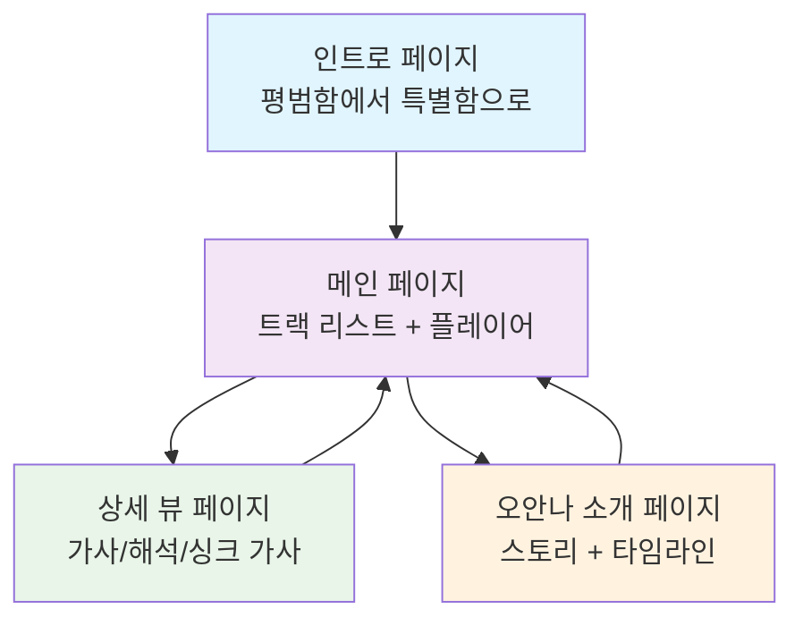
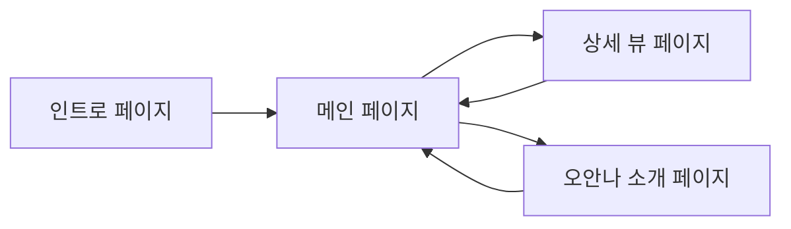

# 🎧 문유 음악 플레이어 화면정의서

[](https://oh.moonwave.kr)
[](https://oh.moonwave.kr)
[](https://github.com/moonwave/music-player)
[](https://oh.moonwave.kr)

> **"평범함에서 특별함으로"** - 재능보다 노력으로, 한계를 넘어 자신만의 빛을 찾아가는 여정을 13개의 트랙으로 표현

## 📋 목차

- [🎯 프로젝트 개요](#-프로젝트-개요)
- [🏗️ 화면 구조도](#️-화면-구조도)
- [🎨 화면별 상세 정의](#-화면별-상세-정의)
- [🧩 공통 컴포넌트](#-공통-컴포넌트)
- [⚡ 상태 관리](#-상태-관리)
- [📱 반응형 디자인](#-반응형-디자인)
- [🚀 성능 최적화](#-성능-최적화)
- [♿ 접근성](#-접근성)
- [📱 PWA 설정](#-pwa-설정)
- [📖 스토리텔링 요소](#-스토리텔링-요소)
- [🧭 네비게이션 플로우](#-네비게이션-플로우)
- [🎨 테마 커스터마이징](#-테마-커스터마이징)

---

## 🎯 프로젝트 개요

### 📊 프로젝트 정보

| 항목 | 내용 |
|------|------|
| **프로젝트명** | Moonwave 오안나 음악 플레이어 |
| **도메인** | https://oh.moonwave.kr |
| **기술 스택** | React + Vite + Tailwind CSS + Catalyst UI |
| **배포** | GitHub Pages (GitHub Actions 자동 배포) |
| **서비스 타입** | 정적 SPA + PWA |

### 🎵 주요 기능

- 🎵 **13곡 음악 플레이어** - 완전한 앨범 경험
- 📱 **모바일 최적화 PWA** - 네이티브 앱 수준의 경험
- 🎨 **글래스모피즘 디자인** - 현대적이고 세련된 UI
- 📖 **가사 싱크 및 해석** - 깊이 있는 음악 이해
- 💫 **스토리텔링 기반 UX** - 감정적 여정 표현

### 🎭 핵심 컨셉

> **"타고난 것보다 만들어가는 것"**
> 
> 재능보다 노력으로, 한계를 넘어 자신만의 빛을 찾아가는 여정을 13개의 트랙으로 표현합니다.

---

## 🏗️ 화면 구조도



### 📱 화면 레이아웃

```
┌─────────────────────────────────────────┐
│           인트로 페이지                  │
│     (평범함에서 특별함으로)             │
└────────────────┬────────────────────────┘
                 │
                 ▼
┌─────────────────────────────────────────┐
│           메인 페이지                    │
│      (트랙 리스트 + 플레이어)           │
├─────────────────┴────────────────────────┤
│                                          │
│  ┌──────────┐  ┌──────────┐            │
│  │트랙 카드1│  │트랙 카드2│  ...       │
│  └──────────┘  └──────────┘            │
│                                          │
├──────────────────────────────────────────┤
│         하단 플레이어 (고정)             │
└──────────────────────────────────────────┘
                 │
                 ▼ (곡 선택시)
┌─────────────────────────────────────────┐
│           상세 뷰 페이지                 │
│    (가사/해석/싱크 가사 표시)           │
└─────────────────────────────────────────┘
                 │
                 ▼
┌─────────────────────────────────────────┐
│           오안나 소개 페이지             │
│         (스토리 + 타임라인)             │
└─────────────────────────────────────────┘
```

---

## 🎨 화면별 상세 정의

### 1️⃣ 인트로 페이지 (Intro)

#### 📋 기본 정보
- **화면 ID**: `INTRO-001`
- **화면명**: 여정의 시작
- **URL**: `/` (첫 방문시)
- **접근 방법**: 첫 방문시 자동 표시

#### 🎨 레이아웃

```
┌─────────────────────────────────────────┐
│                                         │
│         [Moonwave 로고]                 │
│                                         │
│       "평범함에서 특별함으로"           │
│                                         │
│    재능보다 노력으로, 한계를 넘어       │
│    자신만의 빛을 찾아가는 여정.         │
│    13개의 트랙에 담긴 성장의 순간들.    │
│                                         │
│      [음악으로 만나기]                  │
│                                         │
│    "타고난 것보다 만들어가는 것"        │
│                                         │
└─────────────────────────────────────────┘
```

#### 🧩 구성 요소 (Catalyst UI 활용)

| 요소 | Catalyst 컴포넌트 | 설명 | 스타일 |
|------|-------------------|------|--------|
| 배경 | - | 그라디언트 배경 | `bg-gradient-to-br from-purple-500 to-pink-600` |
| 로고 | `` | Moonwave 로고만 | `w-20 h-20 mx-auto mb-8 opacity-90` |
| 메인 문구 | `<Heading>` | "평범함에서 특별함으로" | `text-3xl sm:text-5xl font-bold text-white` |
| 설명 텍스트 | `<Text>` | 여정 설명 | `text-lg text-white/90 max-w-xl leading-relaxed` |
| 시작 버튼 | `<Button>` | 메인 진입 | `variant="solid" color="white"` |
| 인용구 | `<Text>` | 핵심 메시지 | `text-sm text-white/70 italic` |

#### ⚡ 인터랙션
- **페이드인 애니메이션** (하단에서 위로)
- **로고 subtle pulse 애니메이션**
- **버튼 클릭** → 페이드 아웃 후 메인 이동

---

### 2️⃣ 메인 페이지 (Main)

#### 📋 기본 정보
- **화면 ID**: `MAIN-001`
- **화면명**: 13개의 순간들
- **URL**: `/tracks`
- **접근 방법**: 인트로에서 버튼 클릭, 로고 홈버튼

#### 🎨 레이아웃

```
┌─────────────────────────────────────────┐
│  [🏠 로고]              [오안나 이야기] │ Header (고정)
├─────────────────────────────────────────┤
│                                         │
│  13개의 트랙, 13개의 성장               │
│                                         │
│  ┌──────────┐  ┌──────────┐           │
│  │  [커버]  │  │  [커버]  │           │
│  │ ▶ 재생  │  │ ▶ 재생  │           │ Track Grid
│  │ 트랙명  │  │ 트랙명  │           │
│  │  문유   │  │  문유   │           │
│  └──────────┘  └──────────┘           │
│                                         │
│  (... 13곡 그리드 반복 ...)            │
│                                         │
├─────────────────────────────────────────┤
│ [◀] [▶/❚❚] [▶] === [♪] [↓]           │ Player (고정)
│ 현재 트랙 - 문유    0:00 / 3:45        │
└─────────────────────────────────────────┘
```

#### 🧩 구성 요소 (Catalyst UI)

##### 📱 헤더 영역
| 요소 | Catalyst 컴포넌트 | 설명 | 스타일 |
|------|-------------------|------|--------|
| 헤더 | `<div>` | 상단 고정 헤더 | `fixed top-0 z-50 w-full p-4 flex justify-between` |
| 홈 버튼 | `<Button>` | 글래스카드 홈버튼 | `bg-white/10 backdrop-blur-md border border-white/20 hover:bg-white/20` |
| 로고 | `` | Moonwave 로고 | `w-8 h-8` |
| About 링크 | `<Button>` | 오안나 소개 페이지 | `variant="ghost" text-sm`|

##### 🎵 트랙 그리드
| 요소 | Catalyst 컴포넌트 | 설명 | 스타일 |
|------|-------------------|------|--------|
| 그리드 | `<div>` + Grid | 반응형 그리드 | `grid grid-cols-1 sm:grid-cols-2 lg:grid-cols-3 xl:grid-cols-4 gap-6` |
| 트랙 카드 | `<Card>` | 개별 곡 카드 | Catalyst Card 스타일 |
| 커버 이미지 | `` | 앨범 커버 | `aspect-square object-cover` |
| 재생 버튼 | `<Button>` | 재생/정지 | `shape="circle" variant="ghost"` |
| 트랙명 | `<Heading>` | 곡 제목 | `level={3}` |
| 아티스트 | `<Text>` | "문유" | `color="gray"` |

##### 🎧 플레이어 영역 (Catalyst UI)
| 요소 | Catalyst 컴포넌트 | 설명 | 스타일 |
|------|-------------------|------|--------|
| 플레이어 | `<div>` + Border | 하단 고정 | `fixed bottom-0 bg-white border-t` |
| 컨트롤 그룹 | `<ButtonGroup>` | 재생 컨트롤 | Catalyst ButtonGroup |
| 재생 버튼 | `<Button>` | 메인 재생 | `color="purple" variant="solid"` |
| 진행바 | `<Slider>` | 재생 위치 | Catalyst Slider |
| 볼륨 | `<Slider>` | 볼륨 조절 | `size="sm"` |
| 다운로드 | `<Button>` | MP3 다운로드 | `variant="ghost"` |

---

### 3️⃣ 상세 뷰 페이지 (Detail)

#### 📋 기본 정보
- **화면 ID**: `DETAIL-001`
- **화면명**: 트랙 상세
- **URL**: `/track/:id`
- **접근 방법**: 메인에서 트랙 카드 클릭

#### 🎨 레이아웃

```
┌─────────────────────────────────────────┐
│  [← 뒤로]          트랙명               │ Header
├─────────────────────────────────────────┤
│                                         │
│         [대형 커버 이미지]              │
│                                         │
│           "Shine Bright"                │
│              문유                       │
│                                         │
├─────────────────────────────────────────┤
│  [가사] [해석] [싱크]  (탭 메뉴)        │
├─────────────────────────────────────────┤
│                                         │
│  가사 내용이 여기에 표시됩니다...        │
│                                         │
│  [싱크 가사 표시 영역]                  │
│                                         │
└─────────────────────────────────────────┘
```

#### 🧩 구성 요소

##### 📱 헤더 영역
| 요소 | Catalyst 컴포넌트 | 설명 | 스타일 |
|------|-------------------|------|--------|
| 뒤로가기 | `<Button>` | 메인으로 이동 | `variant="ghost"` |
| 트랙명 | `<Heading>` | 현재 곡 제목 | `level={2}` |
| 아티스트 | `<Text>` | "문유" | `color="gray"` |

##### 🎵 커버 영역
| 요소 | Catalyst 컴포넌트 | 설명 | 스타일 |
|------|-------------------|------|--------|
| 커버 이미지 | `` | 대형 앨범 커버 | `w-full h-64 object-cover` |
| 트랙 정보 | `<div>` | 제목 + 아티스트 | `text-center mt-4` |

##### 📖 탭 메뉴
| 요소 | Catalyst 컴포넌트 | 설명 | 스타일 |
|------|-------------------|------|--------|
| 탭 그룹 | `<Tabs>` | 가사/해석/싱크 | Catalyst Tabs |
| 가사 탭 | `<Tab>` | 원문 가사 | `variant="ghost"` |
| 해석 탭 | `<Tab>` | 가사 해석 | `variant="ghost"` |
| 싱크 탭 | `<Tab>` | 싱크 가사 | `variant="ghost"` |

---

### 4️⃣ 오안나 소개 페이지 (About)

#### 📋 기본 정보
- **화면 ID**: `ABOUT-001`
- **화면명**: 오안나 이야기
- **URL**: `/about`
- **접근 방법**: 메인 헤더의 "오안나 이야기" 버튼

#### 🎨 레이아웃

```
┌─────────────────────────────────────────┐
│  [← 뒤로]        오안나 이야기          │ Header
├─────────────────────────────────────────┤
│                                         │
│         [오안나 프로필 이미지]           │
│                                         │
│           "오안나"                      │
│        평범함에서 특별함으로            │
│                                         │
├─────────────────────────────────────────┤
│  [스토리] [타임라인] [음악] (탭 메뉴)    │
├─────────────────────────────────────────┤
│                                         │
│  스토리 내용이 여기에 표시됩니다...      │
│                                         │
│  [타임라인 표시 영역]                   │
│                                         │
└─────────────────────────────────────────┘
```

---

## 🧩 공통 컴포넌트

### 🎨 글래스모피즘 카드
```typescript
interface GlassCardProps {
  children: React.ReactNode;
  className?: string;
}

const GlassCard: React.FC<GlassCardProps> = ({ children, className }) => (
  <div className={`
    bg-white/10 backdrop-blur-md 
    border border-white/20 rounded-xl
    shadow-lg hover:bg-white/20 
    transition-all duration-300
    ${className}
  `}>
    {children}
  </div>
);
```

### 🎵 음악 플레이어 컴포넌트
```typescript
interface AudioPlayerProps {
  currentTrack: Track;
  isPlaying: boolean;
  onPlayPause: () => void;
  onNext: () => void;
  onPrevious: () => void;
}
```

### 📱 반응형 그리드
```typescript
const TrackGrid: React.FC = () => (
  <div className="
    grid grid-cols-1 sm:grid-cols-2 
    lg:grid-cols-3 xl:grid-cols-4 
    gap-4 md:gap-6
  ">
    {/* Track cards */}
  </div>
);
```

---

## ⚡ 상태 관리

### 🎵 음악 상태
```typescript
interface MusicState {
  currentTrack: Track | null;
  isPlaying: boolean;
  currentTime: number;
  duration: number;
  volume: number;
  playlist: Track[];
  currentIndex: number;
}
```

### 📱 UI 상태
```typescript
interface UIState {
  currentPage: 'intro' | 'main' | 'detail' | 'about';
  selectedTrackId: string | null;
  activeTab: 'lyrics' | 'interpretation' | 'sync';
  isLoading: boolean;
  error: string | null;
}
```

### 🔄 상태 업데이트 패턴
```typescript
// Zustand store 예시
const useMusicStore = create<MusicState>((set) => ({
  currentTrack: null,
  isPlaying: false,
  currentTime: 0,
  duration: 0,
  volume: 1,
  playlist: [],
  currentIndex: 0,
  
  setCurrentTrack: (track) => set({ currentTrack: track }),
  togglePlay: () => set((state) => ({ isPlaying: !state.isPlaying })),
  updateTime: (time) => set({ currentTime: time }),
  // ... 기타 액션들
}));
```

---

## 📱 반응형 디자인

### 📐 브레이크포인트
```css
/* Tailwind CSS 브레이크포인트 */
sm: 640px   /* 모바일 가로 */
md: 768px   /* 태블릿 */
lg: 1024px  /* 데스크톱 */
xl: 1280px  /* 대형 화면 */
2xl: 1536px /* 초대형 화면 */
```

### 🎨 반응형 그리드 시스템
```typescript
// 트랙 카드 그리드
const gridClasses = {
  mobile: "grid-cols-1",      // 1열
  tablet: "sm:grid-cols-2",   // 2열
  desktop: "lg:grid-cols-3",  // 3열
  large: "xl:grid-cols-4"     // 4열
};
```

### 📱 모바일 최적화
- **터치 친화적 버튼 크기** (최소 44px)
- **스와이프 제스처** 지원
- **하단 플레이어** 고정 위치
- **풀스크린 모드** 지원

---

## 🚀 성능 최적화

### 📦 코드 스플리팅
```typescript
// React.lazy를 사용한 지연 로딩
const DetailPage = lazy(() => import('./pages/DetailPage'));
const AboutPage = lazy(() => import('./pages/AboutPage'));

// Suspense로 로딩 상태 처리
<Suspense fallback={<LoadingSpinner />}>
  <DetailPage />
</Suspense>
```

### 🖼️ 이미지 최적화
```typescript
// WebP 포맷 우선 사용
const optimizedImage = (src: string) => {
  const webpSrc = src.replace(/\.(jpg|jpeg|png)$/, '.webp');
  return (
    <picture>
      <source srcSet={webpSrc} type="image/webp" />
      
    </picture>
  );
};
```

### 🎵 오디오 최적화
```typescript
// 오디오 프리로딩
const preloadAudio = (tracks: Track[]) => {
  tracks.forEach(track => {
    const audio = new Audio();
    audio.preload = 'metadata';
    audio.src = track.audioUrl;
  });
};
```

### ⚡ 메모이제이션
```typescript
// React.memo로 불필요한 리렌더링 방지
const TrackCard = React.memo(({ track, onSelect }) => (
  <Card onClick={() => onSelect(track)}>
    {/* Track card content */}
  </Card>
));

// useMemo로 계산 최적화
const filteredTracks = useMemo(() => 
  tracks.filter(track => track.title.includes(searchTerm)),
  [tracks, searchTerm]
);
```

---

## ♿ 접근성

### 🎯 WCAG 2.1 준수
- **AA 레벨** 기준 준수
- **키보드 네비게이션** 완전 지원
- **스크린 리더** 호환성

### ⌨️ 키보드 접근성
```typescript
// 키보드 단축키
const keyboardShortcuts = {
  'Space': 'play/pause',
  'ArrowLeft': 'previous track',
  'ArrowRight': 'next track',
  'ArrowUp': 'volume up',
  'ArrowDown': 'volume down',
  'M': 'mute/unmute'
};
```

### 🎨 색상 대비
```css
/* 최소 대비율 4.5:1 보장 */
.text-primary { color: #1a1a1a; } /* 검은색 배경 */
.text-secondary { color: #4a4a4a; } /* 회색 배경 */
.text-accent { color: #a855f7; } /* 보라색 강조 */
```

### 📱 포커스 관리
```typescript
// 포커스 트랩 (모달 내부)
const FocusTrap: React.FC = ({ children }) => {
  const containerRef = useRef<HTMLDivElement>(null);
  
  useEffect(() => {
    const focusableElements = containerRef.current?.querySelectorAll(
      'button, [href], input, select, textarea, [tabindex]:not([tabindex="-1"])'
    );
    // 포커스 관리 로직
  }, []);
  
  return <div ref={containerRef}>{children}</div>;
};
```

---

## 📱 PWA 설정

### 📄 Manifest.json
```json
{
  "name": "Moonwave 오안나 음악 플레이어",
  "short_name": "문유 음악",
  "description": "평범함에서 특별함으로 - 13개의 성장 이야기",
  "start_url": "/",
  "display": "standalone",
  "background_color": "#a855f7",
  "theme_color": "#a855f7",
  "orientation": "portrait",
  "icons": [
    {
      "src": "/icon-192.png",
      "sizes": "192x192",
      "type": "image/png"
    },
    {
      "src": "/icon-512.png",
      "sizes": "512x512",
      "type": "image/png"
    }
  ]
}
```

### 🔧 Service Worker
```typescript
// 오프라인 지원 및 캐싱
const CACHE_NAME = 'moonwave-v1';
const urlsToCache = [
  '/',
  '/tracks',
  '/about',
  '/music/*.mp3',
  '/covers/*.jpg'
];

// 캐시 전략
self.addEventListener('fetch', (event) => {
  if (event.request.url.includes('/music/')) {
    // 오디오 파일은 네트워크 우선, 캐시 폴백
    event.respondWith(
      fetch(event.request).catch(() => 
        caches.match(event.request)
      )
    );
  } else {
    // 정적 파일은 캐시 우선
    event.respondWith(
      caches.match(event.request).then((response) =>
        response || fetch(event.request)
      )
    );
  }
});
```

---

## 📖 스토리텔링 요소

### 🎭 트랙별 테마 매핑

| 구간 | 트랙 | 테마 | 색상 톤 |
|------|------|------|---------|
| **Track 1-3** | 평범한 시작 | Beginning | 차가운 파란색 |
| **Track 4-7** | 노력과 성장 | Growth | 중간 톤 보라색 |
| **Track 8-10** | 도전과 극복 | Challenge | 따뜻한 주황색 |
| **Track 11-13** | 자신만의 빛 | Shine | 밝은 노란색 |

### 🎨 시각적 내러티브
- **커버 이미지**: 추상적 → 구체적 변화
- **색상 톤**: 차가운 색 → 따뜻한 색 진행
- **가사 밀도**: 간결함 → 풍부함 확장

### 💫 인터랙션 스토리텔링
- **스크롤 기반 애니메이션**
- **음악과 시각적 동기화**
- **감정적 여정 표현**

---

## 🧭 네비게이션 플로우

### 📱 페이지 이동 경로


### 🔗 글로벌 네비게이션
- **로고 홈버튼**: 모든 페이지에서 메인으로 이동
- **About 링크**: 메인 페이지 우측 상단
- **뒤로가기**: 상세 페이지에서 메인으로

### 🌐 URL 구조
| 경로 | 설명 | 접근 방법 |
|------|------|-----------|
| `/` | 인트로 (첫 방문) / 메인 (재방문) | 자동 |
| `/tracks` | 메인 페이지 | 인트로에서 버튼 |
| `/track/:id` | 트랙 상세 | 메인에서 카드 클릭 |
| `/about` | 오안나 소개 | 헤더 About 버튼 |

---

## 🎨 테마 커스터마이징

### 🎨 컬러 팔레트
```javascript
// tailwind.config.js 확장
module.exports = {
  theme: {
    extend: {
      colors: {
        purple: {
          50: '#faf5ff',
          500: '#a855f7',  // 메인 컬러
          600: '#9333ea',
        },
        pink: {
          500: '#ec4899',  // 보조 컬러
          600: '#db2777',
        }
      }
    }
  }
}
```

### 📝 타이포그래피
- **Catalyst 기본 폰트 시스템** 활용
- **한글 최적화**: Pretendard 추가 적용
- **가독성 최적화**: 적절한 행간과 자간

---

## 📌 버전 정보

| 항목 | 내용 |
|------|------|
| **문서 버전** | v3.0 |
| **작성일** | 2025-01-30 |
| **마지막 업데이트** | 2025-01-30 |

### 🔄 주요 변경사항
- ✅ 구조 개선 및 목차 추가
- ✅ 성능 최적화 섹션 강화
- ✅ 접근성 가이드라인 추가
- ✅ PWA 설정 상세화
- ✅ 스토리텔링 요소 확장

---

## 📞 연락처

- **프로젝트**: [Moonwave 오안나 음악 플레이어](https://oh.moonwave.kr)
- **문의**: [GitHub Issues](https://github.com/moonwave/music-player/issues)
- **라이선스**: MIT License

---

<div align="center">

**🎧 평범함에서 특별함으로 - 문유와 함께하는 음악 여정 🎵**

</div>